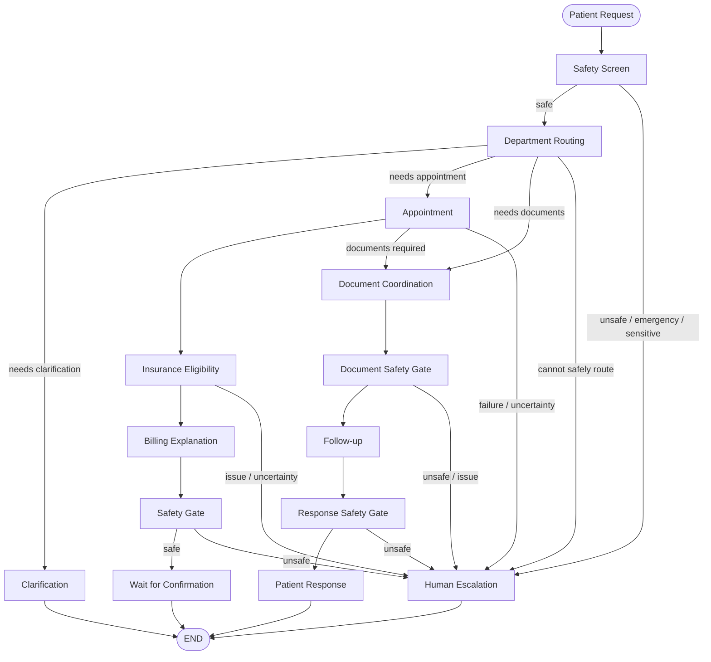
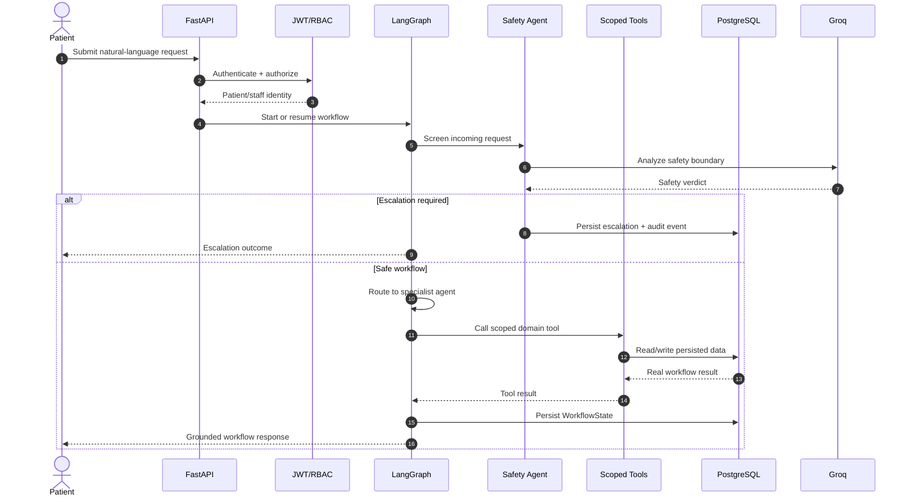

<div align="center">

# CarePilot AI

### Agentic AI for Patient Administration & Care Coordination.

CarePilot AI is a multi-agent, tool-using system that manages a patient's **non-clinical hospital journey** from registration and department routing to appointment booking, document coordination, reminders, insurance eligibility pre-checks, and plain-language billing explanations.

Every uncertain, emergency, or sensitive case is routed to a human instead of being handled autonomously.

[](https://carepilot-app.up.railway.app/)
[](https://github.com/mansari40/CarePilot-AI/tree/main/backend/tests)
[](https://www.python.org/)
[](https://fastapi.tiangolo.com/)
[](https://www.langchain.com/langgraph)
[](https://groq.com/)
[](https://www.postgresql.org/)
[](https://railway.app/)

[**Explore the live app**](https://carepilot-app.up.railway.app/) ·
[**Explore the architecture**](#architecture) ·
[**Run locally**](#run-locally) ·
[**Review the tests**](#quality-gates)

<p>If you find CarePilot AI useful, please give the project a star ⭐ on GitHub!</p>

</div>

---

## The safety boundary

> **CarePilot AI is not a diagnosis or treatment system.**

No agent, tool, or prompt may diagnose a condition, suggest treatment, prescribe or adjust medication, or claim to replace a clinician.

This is not treated as a prompt-level instruction. The boundary is enforced in the application through the **Safety & Escalation Agent** and deterministic graph routing.

---

## At a glance

| | |
|---|---|
| **Hospital journey** | Registration → intent detection → department routing → appointment booking → documents → reminders → follow-up |
| **Agent system** | 8 specialist agent roles orchestrated as a bounded LangGraph `StateGraph` |
| **LLM** | Groq through `langchain-groq` / `ChatGroq` |
| **Persistence** | PostgreSQL 16 with SQLAlchemy 2.0 and Alembic |
| **Workflow state** | Shared `WorkflowState` persisted through a PostgreSQL-backed LangGraph checkpointer |
| **Safety** | Entry screening plus output safety gates before patient-facing responses |
| **Access control** | JWT authentication with separate patient/staff permissions and server-side RBAC |
| **Languages** | 6 UI languages: English, Spanish, French, Dari, and Pashto |
| **Analytics** | Staff-only dashboard with appointment, document, escalation, insurance, and operational metrics |
| **Frontend** | React 18 + Vite + TypeScript + Tailwind CSS v4 + Framer Motion + Recharts |

---

## The story

Most healthcare chatbots stop at answering questions.

CarePilot AI is designed around a different problem: **patient administration is a workflow, not a single chat response.**

A patient request can require several coordinated actions identifying the right department, finding an available slot, checking insurance eligibility, explaining an estimated cost, collecting documents, and setting a reminder.

Instead of giving one LLM unrestricted access to the entire application, CarePilot AI uses **specialized agents with scoped tools**, connected through an explicit LangGraph workflow.

The important guarantees are:

| Invariant | What CarePilot AI enforces |
|---|---|
| **No clinical autonomy** | Clinical, emergency, uncertain, and sensitive requests are escalated to a human. |
| **No unrestricted agents** | Each specialist receives only its own scoped tool set. |
| **No client-side RBAC** | Authorization is enforced on the backend, not only by hiding UI links. |
| **No fabricated workflow results** | Patient-facing responses are assembled from persisted tool and workflow results. |
| **No cross-patient access** | Patient resources are scoped to the authenticated patient's identity. |
| **No unsafe output bypass** | Safety gates inspect workflow outputs before they reach the patient. |
| **No lost workflow state** | LangGraph state is persisted in PostgreSQL so interrupted workflows can resume. |
| **No billing overclaiming** | Billing output is explicitly an estimate, not an invoice or payment guarantee. |

---

# Architecture

CarePilot AI is built as an explicit state machine rather than an open-ended agent loop.

The request enters through a safety gate, moves through specialist workflow nodes, and reaches a terminal state such as completion, clarification, document wait, or human escalation.

### Agent workflow



### Request lifecycle



---

## The specialist agents

Each agent has a defined responsibility, scoped tools, and a completion mechanism.

| Node | Agent | Responsibility |
|---|---|---|
| `safety_screen` | Safety & Escalation | Screen every incoming request |
| `route_department` | Department Routing | Identify the appropriate hospital department |
| `book_appointment` | Appointment | Find, book, reschedule, or cancel appointments |
| `insurance_check` | Insurance Eligibility | Check policy and eligibility status |
| `billing_generate` | Billing | Produce plain-language cost estimates |
| `document_ingest` | Document | Classify, retrieve, and attach documents |
| `followup` | Follow-up | Create patient reminders |
| `safety_before_*` | Safety & Escalation | Output safety gates before sensitive workflow transitions |

### Scoped tools

| Agent | Tools |
|---|---|
| **Safety & Escalation** | `create_escalation`, `log_audit_event` |
| **Department Routing** | `find_department` |
| **Appointment** | `list_available_slots`, `book_appointment`, `reschedule_appointment`, `cancel_appointment`, `get_appointment` |
| **Insurance Eligibility** | `lookup_insurance`, `check_eligibility`, `get_active_policy` |
| **Billing** | `lookup_fee_items`, `generate_billing_explanation` |
| **Document** | `get_patient_documents`, `classify_document`, `attach_document_to_appointment` |
| **Follow-up** | `create_reminder` |

The important architectural property is that an agent does **not** receive the entire tool registry. Tool access is scoped with `bind_tools`, reducing the blast radius of an incorrect model decision.

---

# WorkflowState - the coordination contract

All graph nodes share a typed `WorkflowState`.

```text
WorkflowState

├── Core:          workflow_run_id, patient_id, request_text, thread_id,
│                  status, current_step
├── Messages:      messages, tool_results
├── Language:      preferred_language
├── Safety:        safety_verdict, safety_reason, escalation_id
├── Routing:       department_id, department_name, clarify_question
├── Coordination:  needs_booking, needs_document, needs_reminder
├── Appointment:   appointment_id, appointment_at
├── Documents:     document_id, document_type, missing_documents
├── Follow-up:     reminder_id
├── Insurance:     insurance_check_id, eligibility_status
├── Billing:       billing_explanation_id, estimated_cost
├── Control:       node_done, failed_attempts, turns
└── Output:        final_response
```

Each node reads the fields it needs and writes its outcome back into the shared state.

### State progression

1. `safety_screen` writes the safety verdict.
2. `route_department` determines the department and next workflow requirement.
3. `book_appointment` persists the appointment result.
4. `insurance_check` persists eligibility status and check ID.
5. `billing_generate` produces a persisted cost estimate.
6. `document_ingest` records document status and missing documents.
7. `followup` creates a reminder when required.
8. `final_response` is assembled from actual workflow results.

---

# Checkpointing and resumability

CarePilot AI persists the complete `WorkflowState` through a PostgreSQL-backed LangGraph checkpointer.

Every LLM step and tool call can therefore leave a durable workflow state behind.

If the backend restarts while a workflow is in progress, `resume_workflow` can recover the checkpoint and re-enter the graph at the appropriate node.

This is an important distinction between a chatbot that simply returns text and an **agentic workflow system that can coordinate stateful work**.

---

# Safety architecture

Safety is implemented as a **routing mechanism**, not merely as a system prompt.

### 1. Entry safety gate

`safety_screen` runs before other specialist agents receive the request.

Requests involving areas such as:

- diagnosis
- treatment
- prescriptions
- self-harm
- emergency symptoms
- other sensitive or uncertain situations

are routed to the escalation terminal.

### 2. Output safety gates

Additional safety nodes inspect workflow outputs before they are exposed to the patient:

- `safety_before_clarify`
- `safety_before_confirm`
- `safety_before_doc`
- `safety_before_respond`

### 3. Deterministic escalation routing

Escalation is not left to an LLM-controlled decision after the safety check.

The graph checks for the escalation state and routes to the `escalate` terminal when required.

**The model can propose content; it does not control the final safety routing.**

---

# Extensions

## Insurance Eligibility

After appointment booking, the insurance agent:

1. Looks up the patient's policy.
2. Retrieves the active policy.
3. Runs an eligibility check.
4. Persists the result in the workflow state and database.

Possible outcomes include:

- `covered`
- `needs_preauthorization`
- `not_covered`
- `no_policy`

---

## Billing Explanation

The billing agent retrieves department-specific fee items and generates a plain-language explanation.

The result is explicitly an **estimate**, not an invoice.

The application is designed to avoid representing an estimate as a payment guarantee.

---

## Multilingual Layer

CarePilot AI supports a multilingual outer request/response layer.

### Incoming

`detect_language()` identifies non-English requests and `translate_to_english()` translates them before the workflow runs.

### Internal reasoning

Agents reason in English so the workflow remains consistent across languages.

### Outgoing

`translate_from_english()` converts the final response into the patient's preferred language.

The frontend currently supports:

- English
- Spanish
- French
- Dari
- Pashto

Dari & Pashto receive RTL layout handling, and the selected language is persisted on the client.

---

# Analytics Dashboard

CarePilot AI includes a staff-only analytics dashboard backed by real SQL aggregation queries.

Metrics include:

- Appointments by department and status
- Average time from request to booking
- Document completion and duplicate rates
- Escalation volume, resolution time, and severity
- Insurance eligibility outcomes
- Busiest doctors and days

The backend exposes:

```text
GET /api/analytics/dashboard
```

The frontend renders the results using Recharts.

---

# Frontend

## Patient Portal

| Page | Route | Capability |
|---|---|---|
| **My Requests** | `/request` | Submit natural-language requests, view history, track status, confirm bookings, see escalation reasons |
| **Appointments** | `/appointments` | View appointment history and statuses |
| **Documents** | `/documents` | View and upload documents with classification and duplicate detection |
| **Reminders** | `/reminders` | View scheduled reminders |
| **Insurance** | `/insurance` | View policies and eligibility checks |
| **Billing** | `/billing` | View billing explanation summaries |
| **Profile** | `/profile` | Edit profile information and preferred language |

## Staff Console

| Page | Route | Capability |
|---|---|---|
| **Workflows** | `/workflows` | Inspect workflow runs and state |
| **Manage** | `/manage` | Manage departments, doctors, and appointment slots |
| **Escalations** | `/escalations` | Review and resolve escalations |
| **Audit Log** | `/audit` | Review audit events |
| **Dashboard** | `/dashboard` | Operational analytics |

---

# Role-Based Access Control

RBAC is enforced at multiple layers.

### Frontend

Navigation and protected routes are rendered according to the authenticated role.

### Backend

Staff endpoints use a `require_staff` dependency.

Patient endpoints use `get_current_patient_profile`.

### Data isolation

Patients are restricted to their own records through authenticated user → patient identity resolution.

A patient cannot simply change an ID in the URL and access another patient's data.

### Verification

The test suite explicitly verifies that patient users receive `403` responses when attempting to access staff-only endpoints.

---

# API surface

## Authentication

```text
POST /api/auth/register
POST /api/auth/login
```

## Patient

```text
GET   /api/patients/me
PATCH /api/patients/me
GET   /api/patients/me/appointments
GET   /api/patients/me/documents
POST  /api/patients/me/documents
GET   /api/patients/me/reminders
GET   /api/patients/me/insurance
GET   /api/patients/me/eligibility
GET   /api/patients/me/billing
```

## Workflows

```text
POST /api/workflows/run
POST /api/workflows/{id}/resume
GET  /api/workflows/{id}
GET  /api/workflows/
```

## Staff

```text
GET/POST   /api/staff/departments
GET/PATCH  /api/staff/departments/{id}

GET/POST   /api/staff/doctors
GET/PATCH  /api/staff/doctors/{id}

GET/POST   /api/staff/slots
```

## Escalations

```text
GET  /api/escalations/
GET  /api/escalations/{id}
POST /api/escalations/{id}/resolve
```

## Analytics

```text
GET /api/analytics/dashboard
```

## Audit

```text
GET /api/audit/
```

---

# Technology stack

| Layer | Technology | Responsibility |
|---|---|---|
| **Frontend** | React 18 + Vite + TypeScript | Patient portal and staff console |
| **UI** | Tailwind CSS v4 + Framer Motion | Styling and interaction |
| **Charts** | Recharts | Staff analytics |
| **i18n** | react-i18next | Multilingual frontend |
| **Backend** | FastAPI | API and application services |
| **Validation** | Pydantic v2 | Request/state validation |
| **ORM** | SQLAlchemy 2.0 | Database access |
| **Migrations** | Alembic | Schema migrations |
| **Database** | PostgreSQL 16 | Persistent source of truth |
| **LLM** | Groq + ChatGroq | Agent reasoning |
| **Orchestration** | LangGraph | Stateful multi-agent workflow |
| **Infrastructure** | Docker Compose | Local service orchestration |
| **Testing** | pytest | Unit and integration testing |
| **Deployment** | Railway | Production deployment |

---

# Repository structure

```text
CarePilot-AI/
│
├── backend/
│   ├── app/
│   │   ├── agents/              # Specialist agent nodes
│   │   ├── api/                 # FastAPI routes
│   │   ├── models/              # SQLAlchemy models
│   │   ├── schemas/             # Pydantic schemas
│   │   ├── services/            # Business and workflow services
│   │   ├── tools/               # Agent tool implementations
│   │   └── ...
│   │
│   ├── tests/                   # Unit + integration tests
│   ├── alembic/                 # Database migrations
│   └── ...
│
├── frontend/
│   ├── src/
│   │   ├── components/
│   │   ├── pages/
│   │   ├── services/
│   │   └── ...
│   └── ...
│
├── docker-compose.yml
├── .env.example
├── AGENT.md
└── README.md
```

> The exact repository layout may evolve as the project continues; the architecture above describes the current application structure and responsibilities.

---

# Run locally

## Prerequisites

- Python 3.12
- Node.js / npm
- Docker Desktop
- PostgreSQL 16, or the included Docker database
- A Groq API key

## 1. Clone the repository

```bash
git clone https://github.com/mansari40/CarePilot-AI.git
cd CarePilot-AI
```

## 2. Configure environment variables

```bash
cp .env.example .env
```

Set at minimum:

```env
GROQ_API_KEY=your_groq_api_key
POSTGRES_PASSWORD=your_secure_password
```

Do not commit real credentials.

## 3. Start the stack

```bash
docker compose up --build -d
```

## 4. Seed the database

```bash
docker compose run --rm backend python -m app.seed.seed_data
```

## 5. Open the application

```text
Frontend:   http://localhost:3000
Backend:    http://localhost:8000
Health:     http://localhost:8000/health
```

---

# Environment variables

| Variable | Required | Default | Description |
|---|---|---|---|
| `GROQ_API_KEY` | Yes | - | Groq API key for LLM calls |
| `POSTGRES_PASSWORD` | Yes | `agentcare_dev_password` | PostgreSQL password |
| `DATABASE_URL` | Auto | Composed from PostgreSQL variables | SQLAlchemy connection string |
| `CORS_ORIGINS` | No | `http://localhost:3000` | Allowed frontend origins |

For production, use strong randomly generated secrets and provide them through Railway's environment configuration rather than committing them to the repository.

---

# Quality gates

Run the complete test suite with:

```bash
docker compose run --rm backend pytest
```

Verbose mode:

```bash
docker compose run --rm backend pytest -v
```

Run a specific test:

```bash
docker compose run --rm backend pytest tests/unit/test_phase8_analytics.py -v
```

### Current test result

```text
127 passed, 1 warning in ~65s
```

The suite covers:

- SQLAlchemy models and CRUD
- Database migrations
- Lookup and appointment tools
- Appointment booking, cancellation, and rescheduling
- Documents and reminders
- Insurance and billing tools
- LangGraph workflow behavior
- Safety routing
- JWT authentication
- Patient/staff RBAC
- Cross-patient isolation
- Multilingual behavior
- Analytics aggregations and API responses

---

# Live deployment

### CarePilot AI

**Production application:**

https://carepilot-app.up.railway.app/

---

# Design trade-offs

### Specialized agents vs. one general agent

A single unrestricted agent would be simpler to implement, but it would also have a much larger tool and permission surface.

CarePilot AI instead uses specialist agents with scoped tools and deterministic routing.

### LLM decisions vs. deterministic routing

The LLM is useful for language understanding and agent reasoning.

It should **not** control security boundaries, RBAC, or irreversible safety routing.

Those decisions remain in application code.

### Stateful workflows vs. stateless chat

Persisting workflow state adds infrastructure and implementation complexity, but it enables long-running workflows, resumability, auditability, and reliable coordination across multiple agent steps.

### Estimates vs. promises

The billing system produces an estimate from stored fee data. It deliberately does not represent that estimate as an invoice or payment guarantee.

---

## What CarePilot AI is, and is not

**It is:**

- A multi-agent administrative workflow system
- A patient coordination assistant
- A tool-using LangGraph application
- A persistent, stateful workflow engine
- A role-aware patient/staff platform
- A human-escalation system for unsafe or uncertain cases

**It is not:**

- A medical diagnostic assistant
- A treatment recommendation engine
- A prescription system
- A replacement for clinicians
- A system intended to make autonomous clinical decisions

---

<div align="center">

### Built with FastAPI · LangGraph · Groq · PostgreSQL · React

**Made with ❤️ by Mustafa**

[Live App](https://carepilot-app.up.railway.app/) ·
[GitHub](https://github.com/mansari40/CarePilot-AI) ·
[Report an issue](https://github.com/mansari40/CarePilot-AI/issues)

</div>
